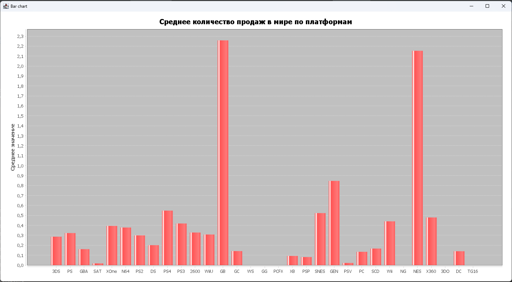
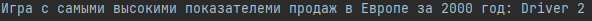
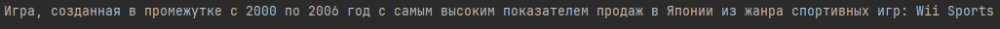

# Вариант 8. Показатели спортивных команд.

## Задание 1
***Задача:*** *Постройте график по средним показателям глобальных продаж, объединив их по платформам.*

**График:**

## Задание 2
***Задача:*** *Выведите игру с самым высоким показателем продаж в Европе за 2000 год*

**Результат:**

## Задание 3
***Задача:*** *Выведите в консоль название игры, созданную в промежутке с 2000 по 2006 год с самым высоким показателем продаж в Японии из жанра спортивных игр.*

**Результат:**

